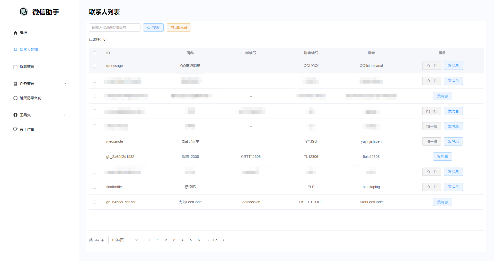
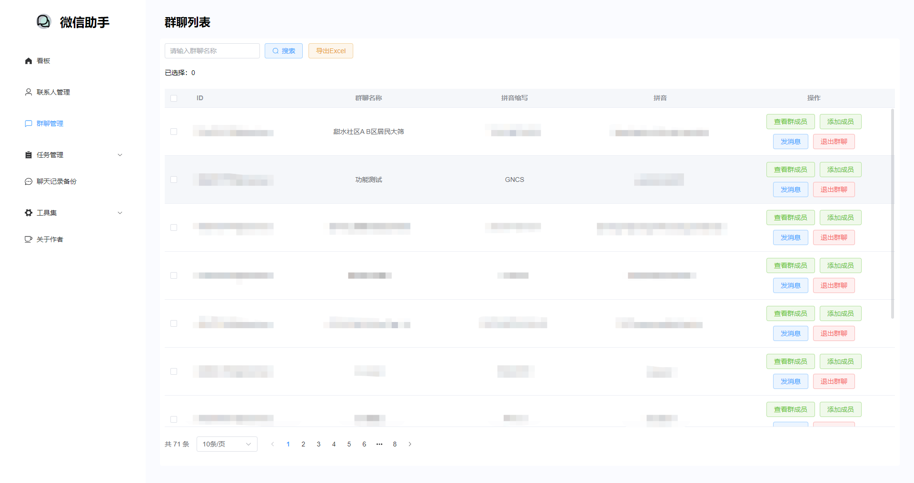
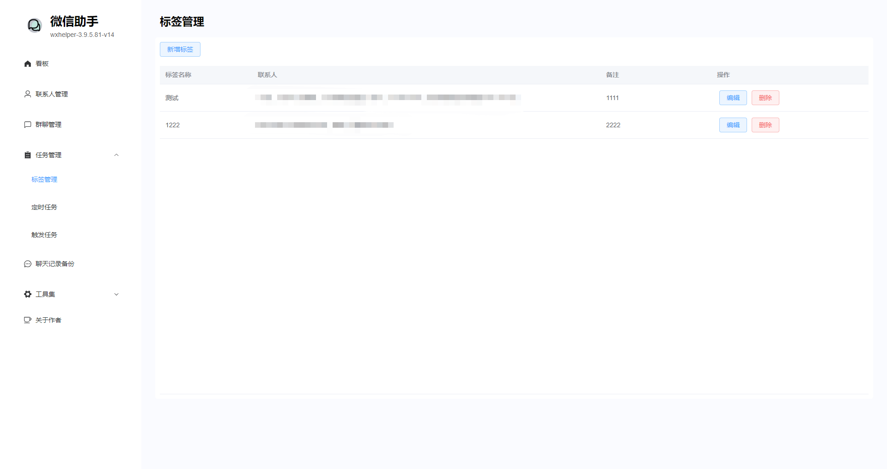
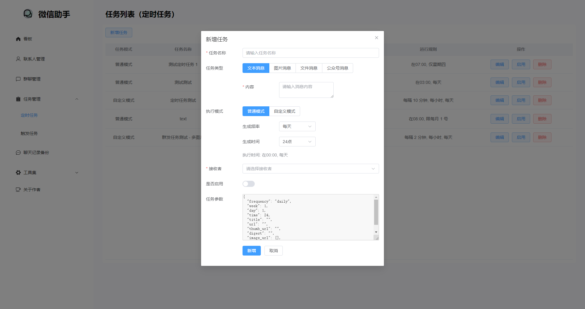
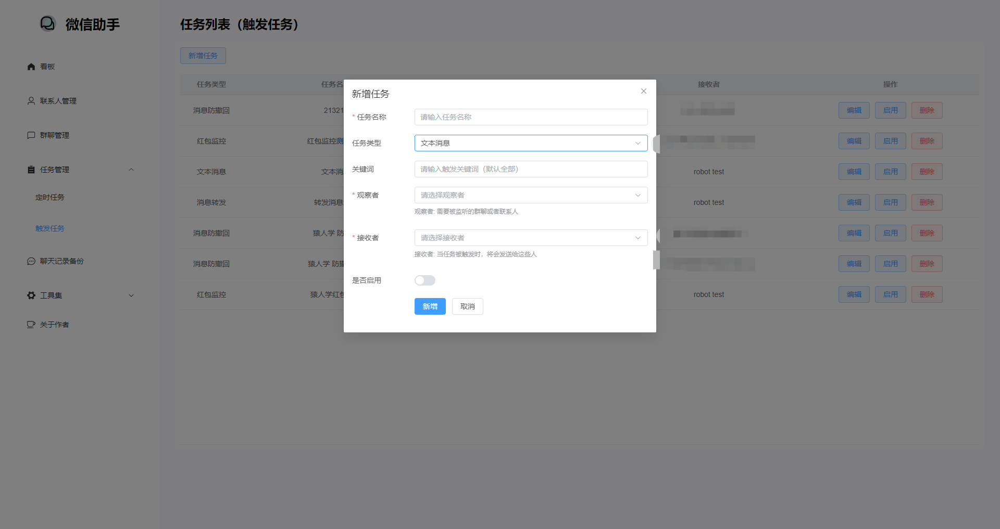
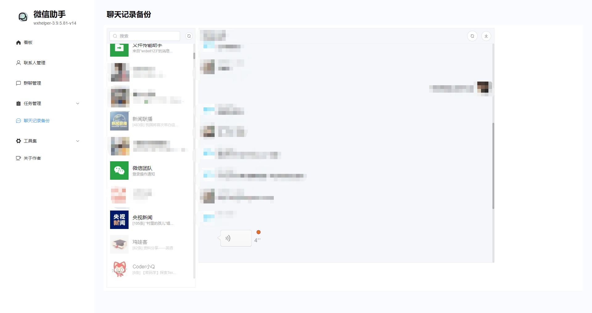
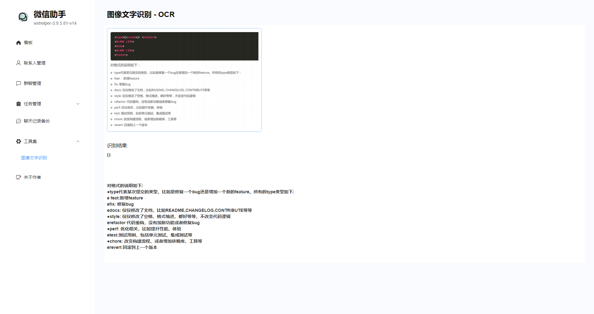

# 功能

介绍 WeChat Assistant 的主要功能模块。

## 一、联系人管理

* 拍一拍
* 发送 “文本、图片、文件、公众号” 消息
* 支持群发消息
* 查看联系人列表、导出联系人列表

## 二、群聊管理

* 发送 “文本、图片、文件、公众号、“@群成员、@全体” 消息
* 支持群发消息
* 查看群聊列表、导出群聊列表
* 查看群成员列表、导出群成员列表
* 邀请成员、退出群聊、删除成员

## 三、任务管理

* 标签管理（支持创建、修改、删除标签）
* 定时任务（定时消息）
  * 定时消息（支持 “文本、图片、文件、公众号” 配置）
* 触发任务（消息防撤回、群红包监控、文本消息监控、消息转发）

 

 

## 四、聊天记录备份

### 已支持

* 还原微信聊天界面（对话列表、查看聊天记录）
  * 支持文本、图片、拍一拍等系统消息
* 支持 “好友/群聊” 聊天记录备份
  * 支持 Excel 导出

### 待开发

* 支持视频、文件、卡片链接等更多消息类型展示
* 支持更多文件格式导出

## 五、工具集

* OCR 文字识别
* 其他功能待补充

