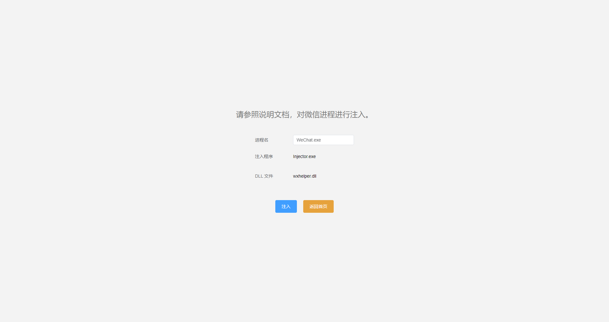
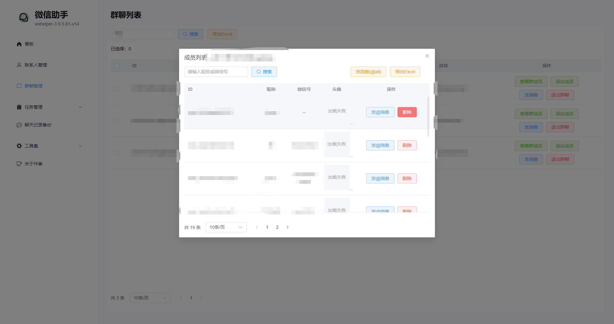

# 快速开始

介绍如何快速安装并运行微信助手。

## 1. Hook 注入

需要特定的微信版本和 dll 才能使 windows hook 工作。

> 如果你不会使用命令行工具，可以跳过 3 步骤，直接运行微信助手客户端。

1. 从 [release](https://github.com/yzqzy/wechat-assistant/releases/tag/v0.0.0) 中下载相关文件
2. 安装 WeChatSetup 3.9.5.81 版本并且登录
3. 使用 Injector 工具进行注入，如果成功的话你将会看到: `Successfully injected module!`

```bash
.\Injector.exe --process-name WeChat.exe --inject .\wxhelper.dll
```

## 2. 安装并运行微信助手

> 推荐使用管理员权限安装并运行微信助手，以便于进行 dll 注入。

> 如果你的系统不是 64 位或者一直没有注入成功，请参考 [issue-65](https://github.com/ttttupup/wxhelper/discussions/65)、[issue-4](https://github.com/yzqzy/wechat-assistant/issues/4)。


如果你已经操作成功注入 dll，可以正常使用应用。

如果你没有注入 dll，会进入以下页面。



注入成功后，即可正常使用程序。


